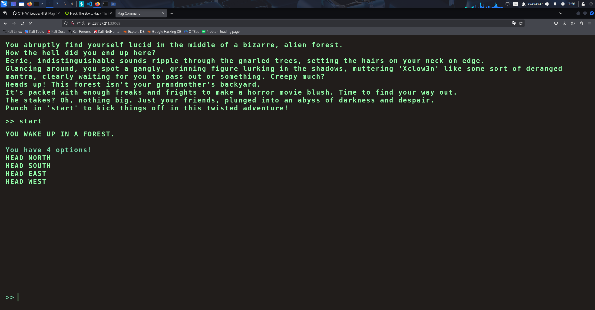
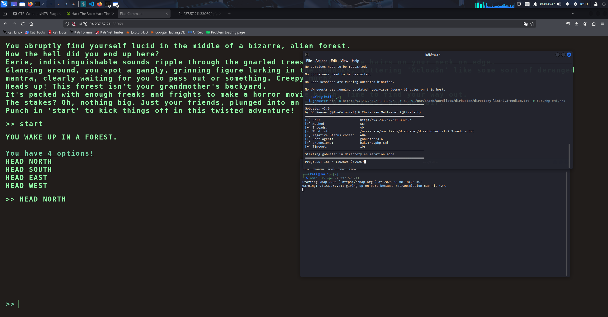
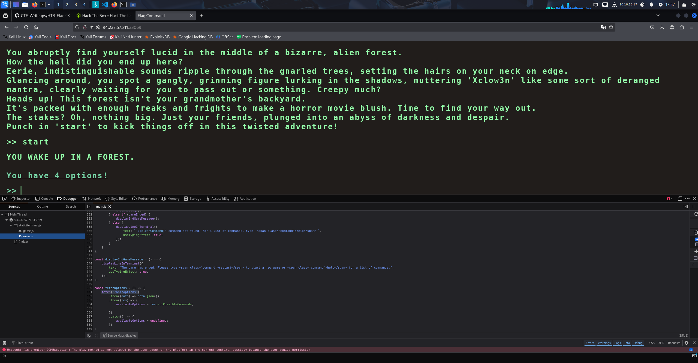
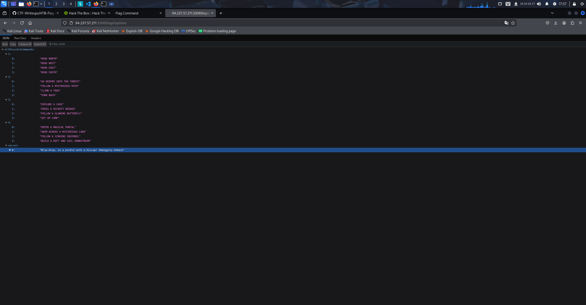
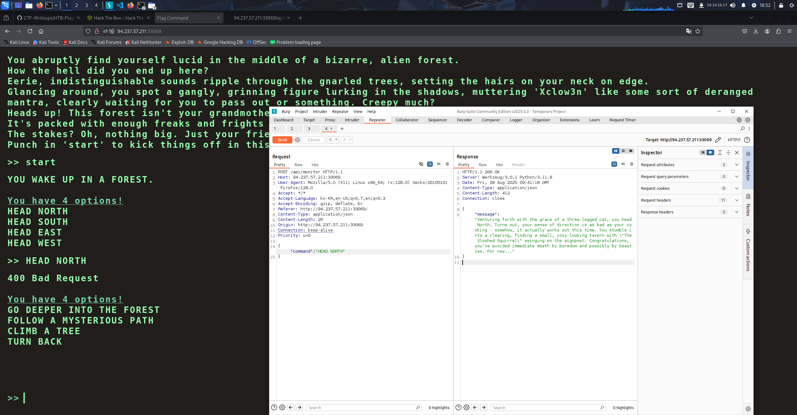
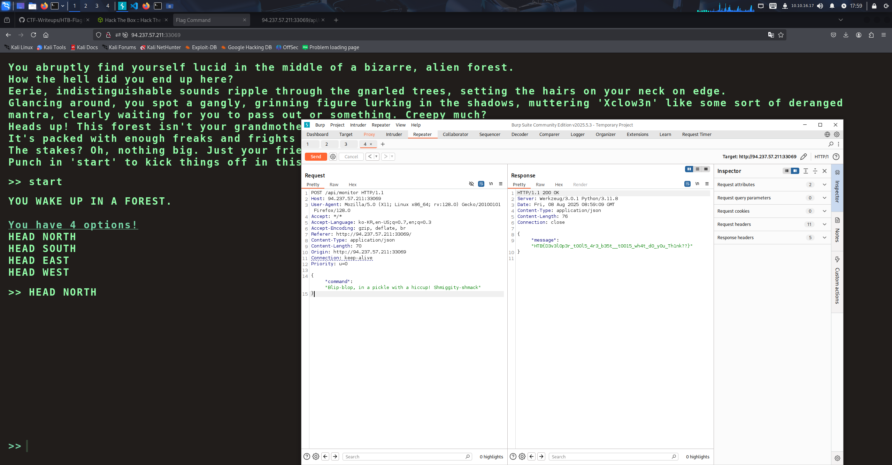

# CTF 설명

"차원 탈출 퀘스트"를 시작하세요. 당신은 이 세상의 것이 아닌 신비로운 숲 미로에서 깨어납니다.  
노래하는 다람쥐, 장난기 넘치는 요정, 심술궂은 마법사들과 함께 기발한 미로를 탐색하며 다른 세상의 놀라운 일들을 마주하게 될지도 모릅니다.  
당신은 마법에 걸린 미로를 정복할 것인가, 아니면 마법의 도전으로 가득한 다른 차원에서 길을 잃게 될 것인가? 이 신비로운 탈출 속에서 여정이 펼쳐집니다!

# 요약

텍스트 형식으로 판타지 세계를 모험하는 컨셉의 CTF  
여러 선택지가 있지만 가장 중요한 것은 어떠한 선택지를 고르는 것이 아니라  
숨겨져 있는 데이터를 찾는 것이다.

1.선택지를 고르면 다음 선택지가 나오는 형식임을 확인  
2.nmap, gobuster를 사용 -> 유의미한 결과를 찾지 못함  
3.JS 코드를 읽어가며 새로운 엔드포인트를 찾음 -> 선택지가 단계별로 모여있음을 확인  
4.선택지 마지막 칸에 secret 정보 획득  
5.Burp suite로 선택지를 고를 때 마다 command값으로 요청이 가는 것을 확인  
6.최종 목적이 탈출이기에 마지막 선택지에 적힌 secret 값을 command값으로 할당후 Repeater로 요청 시도  
7.Flag 획득 : HTB{D3v3l0p3r_t00l5_4r3_b35t\_\_t0015_wh4t_d0_y0u_Th1nk??}

# Write-Up

처음 CTF에 진입하면 안내문과 함께 CTF가 시작되고 "HEAD NORTH" 등 다양한 선택지를 고르면서 이야기를 진행할 수 있다.

 
 
 

하지만 이런방식으로는 CTF 문제의 존재의미가 없을 거 같아서 nmap, gobuster를 돌려보았다.

 
 
 

nmap, gobuster에서 유의미한 결과가 나오기 전, 이전에 버그바운티 관련 Reddit Writeup을 볼 때 누군가 js에서 흥미로운 엔드포인트를 발견하였다는  
글이 생각이 났고 나도 추가적인 진입점을 찾기위해 js 파일을 분석하였다. 그결과 fetch()에 적힌 엔드포인트를 발견하였다.

 
 
 

바로 엔드포인트를 확인하였고 allPossibleCommands라고 되어있는 것과 그 내용을 살펴본 결과 선택지의 내용이라고 추측하였다.
그리고 마지막 secret을 통해 새로운 선택지를 얻었다.

 
 
 

클라 자체에 내가 입력한 선택지에 대한 응답을 담고 있는 내용이 없는것을 미루어보아 선택지 입력에 대한 응답은 서버측으로부터 온다고 생각 하였고  
Burp suite의 프록시 모드를 사용하여 요청과 응답을 잡아보았다.

 
 
 

예상대로 동작하며 이전에 얻은 secret 선택지로 command를 교체하여 플래그를 획득하였다.

