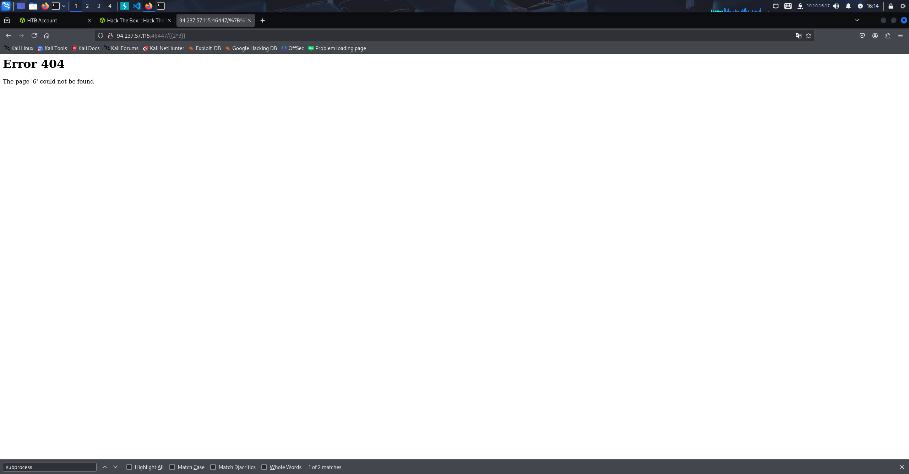

# CTF 설명

이 간단한 실수를 이용할 수 있을까?

# 요약

CTF 제목을 통해 알 수 있듯 SSTI에 대한 문제이며 단지 처음 간단한 에러 메시지를  
보고 SSTI로 이용할 생각을 할 수 있었는지가 핵심이다.

1.사이트 최초 진입시 Error Code를 보고 Flask/Jinja2를 사용하고 있음을 확인

2.{{4*3}} 등을 통해 내부적으로 SSTI 작동이 되는지 확인

3.작동이 되는것을 확인 하였다면 {{"".__class__.__mro__[1].__subclasses__()}}로 서브클래스들 나열

4.RCE연결을 위해 이용가능한 서브클래스 찾기 -> subprocess.Popen발견

5.인덱스를 확인하는 간단한 파이썬 코드 작성후 인덱스 위치 파악 -> 414

6.인덱스 기반으로 subprocess.Popen 클래스에 접근후 본격적으로 내장함수에 접근,  
 subprocess 모듈을 임포트 시켜 check_output함수로 실행시키고자 하는 명령어 실행

7.RCE완성 -> 플래그 획득 : HTB{t3mpl4t3s_4r3_m0r3_p0w3rfu1_th4n_u_th1nk!}

# Write-Up

처음 CTF를 시작하면 바로 에러코드부터 시작되기에 순간 HTB가 문제인가 싶었지만 gobuster를 돌려보니 응답코드가 200이라고 뜨는 것을 보고  
정상상태임을 인식 후 에러코드를 확인하였고 Flask/Jinja2를 사용하고 있음을 확인하였다.

제목에서 힌트를 많이 주었다고 생각한다. Jinja2 확인 후 바로 SSTI가 가능한지 확인해보았고 예상대로 연산이 정상적으로 이루어진다.

SSTI가 존재함을 확인하였기에 바로 RCE로 연결할 수 있을만한 subclasses를 나열시켜 보았고 RCE연결이 가능한 subprocess.Popen을 발견 하였다.

하지만 접근을 위해서는 인덱스 번호를 알아야 하기에 간단한 파이썬 코드를 작성하였는데  
"는 문자처리를 하기위해 \를 사용, html 인코딩된 상태이기에 디코딩, 인덱스를 확인하기위해 ,를 기반으로 Split()시켰다.

코드실행 후 인덱스를 확인해보면 414라고 뜨는것을 볼 수 있다.

바로 [414]로 subclass에 접근 후 내장함수인 \_\_import\_\_를 이용하여 subprocess 모듈을 동적으로 임포트 시키고  
임포트된 모듈을 이용하여 check_output()으로 RCE를 연결해 ls 명령어를 실행하였다.

정상적으로 작동함을 확인하고 ["cat", "flag.txt"]를 사용하여 플래그를 획득하였다.

